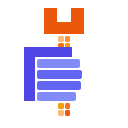

<div align="center">



# handily

**Mods for Claude Code. Panes, bands and quiet rows that show your work items,
your tasks and your sessions, for any tracker.**

[](https://github.com/niksavis/handily/actions/workflows/basicly-gates.yml)
[](https://github.com/niksavis/handily/actions/workflows/release.yml)
[](#early-development)
[](#requirements)
[](LICENSE)

</div>

## What is handily?

handily is a Claude Code plugin marketplace. Each plugin in it is a **mod**: a set of function
hooks that changes what you see in a Claude Code session in the terminal. The mods show your
work items, your tasks, your sessions and your subagents. They also make long replies and tool
calls short on the screen.

- The mods work with any tracker: basicly, beads (`bd`, `br`), beans, or your own tracker
  through a CLI adapter.
- The mods need no harness. No mod needs [basicly](https://github.com/niksavis/basicly).
- **Mods show and ask. They never enforce.** A rule that must hold for every agent belongs in
  a git hook, not in a Claude Code mod.

## Early development

> [!WARNING]
> The mods are in early development. **Expect breaking changes** in any release, also in a
> minor or patch release. A command, a setting, a plugin name or a screen layout can change
> without a deprecation period. Read [CHANGELOG.md](CHANGELOG.md) before you update.

The mod API of Claude Code is in early access, and it changes between Claude Code releases. A
mod can stop working after a Claude Code update, until a new mod release follows.

## Requirements

- **The latest Claude Code**, in a terminal session. The mods support only the newest Claude
  Code version, and CI tests them on that version. Update Claude Code before you update a mod.
- The mods run in Claude Code only. Codex and other agents do not load them.

## Mods

Each mod has a plugin name that starts with `handily-`. Its slash commands keep their short
names, such as `/task` and `/simple`. Each command description in the menu starts with
`handily ·`.

| Mod | What you see | Command |
| --- | --- | --- |
| [`handily-workitems`](mods/handily-workitems/README.md) | Nothing. It reads the work items of your tracker for the other mods | none |
| [`handily-quiet-items`](mods/handily-quiet-items/README.md) | One short row in place of each tracker write in the transcript | `/quiet-items` |
| [`handily-task-pane`](mods/handily-task-pane/README.md) | A task list that Claude and you share, with an optional pane | `/task` |
| [`handily-session-board`](mods/handily-session-board/README.md) | A board of every local Claude Code session: state, task, worktree, time worked | `/session-board` |
| [`handily-item-toasts`](mods/handily-item-toasts/README.md) | A toast when a work item changes outside your session | none |
| [`handily-agent-board`](mods/handily-agent-board/README.md) | A pane that shows what each subagent of this session does | `/agent-board` |
| [`handily-simple-view`](mods/handily-simple-view/README.md) | One short row for each Bash, Edit, Write, Read, Grep and Glob call | `/simple` |
| [`handily-reply-view`](mods/handily-reply-view/README.md) | Long replies fold, tables draw without box lines, copy buttons, a rule above each prompt | `/replies` |
| `handily` | The bundle of all the mods above | `/handily` |

Some mods need another mod. Claude Code installs a dependency with the mod that needs it.

| Mod | Needs |
| --- | --- |
| `handily-workitems` | n/a |
| `handily-quiet-items` | `handily-workitems` |
| `handily-task-pane` | `handily-workitems` |
| `handily-session-board` | n/a |
| `handily-item-toasts` | `handily-workitems` |
| `handily-agent-board` | n/a |
| `handily-simple-view` | `handily-quiet-items`, and through it `handily-workitems` |
| `handily-reply-view` | n/a |
| `handily` | every mod above |

## Quick start

Type these two lines at the prompt of a Claude Code session. The first line registers the
marketplace. The second line installs every mod.

```text
/plugin marketplace add niksavis/handily
/plugin install handily@handily
```

Each install line opens the details of the plugin. Select **Install**, then close the panel.
Then type `/reload-plugins`, or restart Claude Code.

Then type `/handily`. It lists each mod with its version and whether it loaded. It ends with
one line such as `handily: 8 of 8 mods loaded`. When a mod is missing, the list gives the line
that installs it.

## Register the marketplace

You register the marketplace once per machine. In a Claude Code session, type:

```text
/plugin marketplace add niksavis/handily
```

In a shell, run:

```sh
claude plugin marketplace add niksavis/handily
```

The marketplace name is `handily`, so every plugin id ends with `@handily`. Each install line
below also works without this step, when you add `--marketplace niksavis/handily` to it. The
flag registers the marketplace first:

```text
/plugin install handily --marketplace niksavis/handily
```

## Install all mods at once

The `handily` plugin is a bundle. It lists each mod as a dependency, and Claude Code installs
and enables each mod with it.

```text
/plugin install handily@handily
```

In a shell:

```sh
claude plugin install handily@handily
```

## Install one mod

Install a mod by its own name. Claude Code installs its dependencies with it. In a session,
type the `/plugin install` line. In a shell, run the `claude plugin install` line.

### handily-workitems

Reads the work items of the tracker at the session root and gives the other mods one list. It
draws nothing. Needs nothing.

```text
/plugin install handily-workitems@handily
```

```sh
claude plugin install handily-workitems@handily
```

### handily-quiet-items

Draws one short row in place of each tracker write. Needs `handily-workitems`.

```text
/plugin install handily-quiet-items@handily
```

```sh
claude plugin install handily-quiet-items@handily
```

### handily-task-pane

A task list that Claude and you share: model tools, `/task` commands and an optional pane.
Needs `handily-workitems`.

```text
/plugin install handily-task-pane@handily
```

```sh
claude plugin install handily-task-pane@handily
```

### handily-session-board

A board of every local Claude Code session. Needs nothing.

```text
/plugin install handily-session-board@handily
```

```sh
claude plugin install handily-session-board@handily
```

### handily-item-toasts

A toast when a work item changes outside this session. Needs `handily-workitems`.

```text
/plugin install handily-item-toasts@handily
```

```sh
claude plugin install handily-item-toasts@handily
```

### handily-agent-board

A pane that shows what each subagent of this session does. Needs nothing.

```text
/plugin install handily-agent-board@handily
```

```sh
claude plugin install handily-agent-board@handily
```

### handily-simple-view

One short row for each tool call, with buttons to open and copy its output. Needs
`handily-quiet-items`, which needs `handily-workitems`.

```text
/plugin install handily-simple-view@handily
```

```sh
claude plugin install handily-simple-view@handily
```

### handily-reply-view

Long replies fold, tables draw without box lines, and tables and code blocks get copy buttons.
Needs nothing.

```text
/plugin install handily-reply-view@handily
```

```sh
claude plugin install handily-reply-view@handily
```

## Install several mods

Run one install line for each mod that you want. This example installs the task pane, the
session board and the reply view:

```sh
claude plugin install handily-task-pane@handily
claude plugin install handily-session-board@handily
claude plugin install handily-reply-view@handily
```

You can also type `/plugin` in a session, open the `handily` marketplace and select the mods.

After an install, type `/reload-plugins` in each open session, or restart Claude Code.

## Update

First update the marketplace. Claude Code then knows the new versions.

```text
/plugin marketplace update handily
```

In a shell:

```sh
claude plugin marketplace update handily
```

Then update each mod that you installed. `claude plugin update` takes one plugin. An update of
the bundle does not update a mod that is already installed, so update each mod:

```sh
claude plugin update handily-task-pane@handily
```

To update the bundle and every mod, run this line in a shell. A mod that came into the bundle
after your install fails its update with `Plugin "<name>" is not installed`. The line then
installs that mod by its name. The line is safe to run again.

```sh
claude plugin marketplace update handily; for p in handily handily-workitems handily-quiet-items handily-task-pane handily-session-board handily-item-toasts handily-agent-board handily-simple-view handily-reply-view; do claude plugin update "$p@handily" || claude plugin install "$p@handily"; done
```

After an update, type `/reload-plugins` in each open session, or restart Claude Code.

An update keeps the folder of the old version in `~/.claude/plugins/cache/handily/`. Claude
Code loads only the version that `claude plugin list` shows.

## Disable and uninstall

Claude Code does not load the bundle when one of its mods is disabled. Then `/handily` is not
available, and `/plugin` shows which mod to enable. `claude plugin disable` refuses to disable
a mod while the bundle is enabled, so disable the bundle first.

To uninstall one mod, use its name:

```text
/plugin uninstall handily-reply-view@handily
```

To remove the bundle, type the first line in Claude Code and run the second line in a shell.
The uninstall leaves the mods in place. `claude plugin prune` then removes each mod that Claude
Code installed only for the bundle. A mod that you installed by its own name stays until you
uninstall it by name.

```text
/plugin uninstall handily@handily
claude plugin prune
```

To remove the marketplace:

```sh
claude plugin marketplace remove handily
```

### Codex

Codex reads this repository's `.agents/plugins/marketplace.json` first. That file lists no
plugins, so Codex offers none of the mods. If you installed a handily mod in Codex before that
file existed, remove it with `codex plugin remove <name>@handily`.

## Move from the old plugin names

Before handily 0.4.0 the mods had plugin names without `handily-`, such as `workitems@handily`.
An update does not move an old name to the new one. Claude Code keeps the old plugin installed
and does not install the new one. When both are installed, the two copies collide. Claude Code
refuses the commands of one copy, and `handily-workitems` does not load beside `workitems`.

To move, run this line in a shell, then type `/reload-plugins` in each open session. It updates
the marketplace, installs each new name and uninstalls each old name. A command for a plugin
that you did not install fails for that plugin only.

```sh
claude plugin marketplace update handily; for p in workitems quiet-items task-pane session-board item-toasts agent-board simple-view reply-view; do claude plugin install "handily-$p@handily"; done; for p in reply-view simple-view agent-board item-toasts session-board task-pane quiet-items workitems; do claude plugin uninstall "$p@handily"; done; claude plugin update handily@handily
```

Then type `/handily`. It must end with `handily: 8 of 8 mods loaded`. It names each old plugin
that is still installed, with its scope, and prints the command that uninstalls it.
[CHANGELOG.md](CHANGELOG.md) lists every old name and its new name.

## Documentation

| Page | Covers |
| --- | --- |
| `mods/<name>/README.md` | what each mod draws, its commands and its settings |
| [`docs/design.md`](docs/design.md) | the design of the mods, the decisions and the open questions |
| [`docs/mocks.md`](docs/mocks.md) | the approved text mocks of each mod |
| [`CHANGELOG.md`](CHANGELOG.md) | every release, and each breaking change |
| [`CONTRIBUTING.md`](CONTRIBUTING.md) | developing the mods |

## Contributing

Bug reports and ideas are welcome as GitHub issues. For the development setup, the commands and
the quality gates a change must pass, see [`CONTRIBUTING.md`](CONTRIBUTING.md). Work is tracked
in the repository's own tracker (`.basicly/ledger/`), managed by
[basicly](https://github.com/niksavis/basicly).

## License

Released under the [MIT License](LICENSE).
